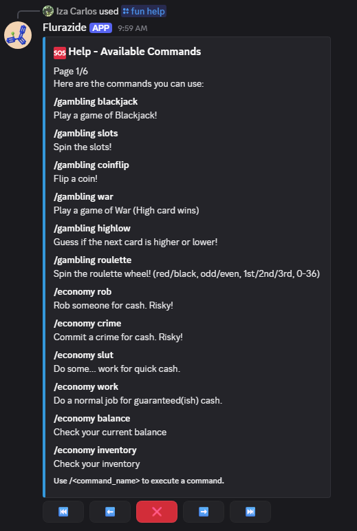
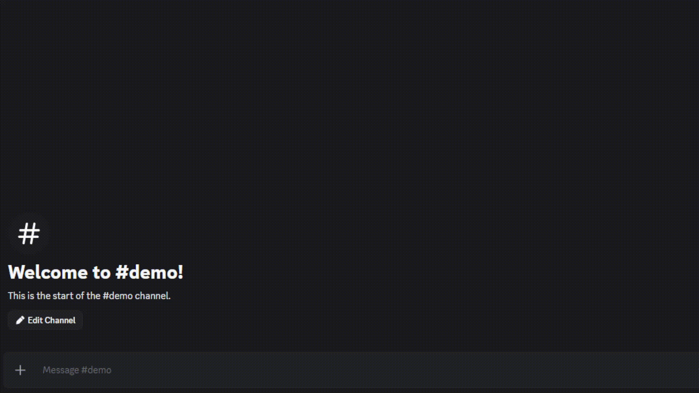

# Flurazide

[![Build Status][build-shield]][build-url]
[![License][license-shield]][license-url]
[![Python Version][python-shield]][python-url]
[![Release][release-shield]][release-url]
[![Platform Color][platform-shield]][platform-url]

**Flurazide** is a feature-rich, multi-purpose Discord bot designed to enhance community engagement through a robust economy system, advanced image manipulation, and comprehensive moderation tools. Built with `discord.py`, it offers a seamless experience for both administrators and users.

---

## 📋 Table of Contents

- [About / Overview](#about--overview)
- [Features](#features)
- [Screenshots / Demo](#screenshots--demo)
- [Installation](#installation)
- [Deployment](#deployment)
- [Usage](#usage)
- [Configuration](#configuration)
- [Project Structure](#project-structure)
- [Roadmap](#roadmap)
- [Contributing](#contributing)
- [Testing](#testing)
- [FAQ](#faq)
- [License](#license)
- [Acknowledgements](#acknowledgements)

---

## 📖 About / Overview

Flurazide exists to provide a "one-stop shop" for Discord server utility and entertainment. Its core philosophy is to blend complex database-driven functions (like a persistent economy and automated backups) with lighthearted, high-quality fun commands. Whether you're looking to moderate your server, simulate a virtual economy, or create memes on the fly, Flurazide is built to handle it with style and efficiency.

---

## ✨ Features

### 🖼️ Image Manipulation
- **Forced GIFs**: Convert static images or links into GIF format for easy sharing.
- **Dynamic Captions**: Add impact-font captions to the top or bottom of images and GIFs.
- **Artifacting**: Apply recursive JPEG artifacting for that "fried" look.
- **Profile Tools**: Easily grab high-resolution avatars and banners from users.

### 💰 Economy & Gambling
- **Persistent Currency**: Earn, spend, and trade virtual currency across commands.
- **Virtual Shop**: Purchase the set of items available in the store.
- **Casino Games**: Test your luck with virtual betting (no real money involved).

### 🛠️ Moderation & Utility
- **Automated Sanctions**: Efficiently manage bans, kicks, and message clearing.
- **Case System**: Full moderation case management with search, edit, and pagination.
- **Backup System**: Automated database backups to Google Drive via service account integration.
- **Server Metrics**: Detailed `/serverinfo` and `/info` commands for deep insights.

### 🎲 Miscellaneous & Fun
- **Interactive Games**: 8-ball, dice rolling with advanced expression support (`/roll 1d20+5`), and simulated "hacks".
- **External APIs**: Integration with PokéAPI, XKCD, random cat/dog image providers and so much more.
- **Utilities**: Currency exchange, height conversion, Urban Dictionary lookup, and Base64 encoding.

---

## 🖼️ Screenshots / Demo

### Command Overview


### Image Manipulation Example


### Economy Interaction


---

## 🚀 Installation

### Prerequisites
- Python 3.10 or higher
- A Discord Bot Token (via [Discord Developer Portal](https://discord.com/developers/applications))
- (Optional) Google Cloud Service Account for backups

### Quick Install
1. **Clone the repository:**
   ```bash
   git clone https://github.com/ThatOneFBIAgent/Flurazida.git
   cd Flurazida
   ```
2. **Install dependencies:**
   ```bash
   pip install -r requirements.txt
   ```
3. **Run the initialization helper:**
   ```bash
   python startbot.py
   ```
   Follow the interactive prompts to set up your environment.

4. **Start the bot:**
   ```bash
   python src/main.py
   ```

---

## 🚢 Deployment

### 🐳 Local Docker Build
The Dockerfile uses a **multi-stage build** to keep the final image slim and reduce memory consumption:

1. **Build the image:**
   ```bash
   docker build -t flurazide-bot .
   ```
2. **Run the container:** (Ensure your `.env` file is in the current directory)
   ```bash
   docker run --env-file .env flurazide-bot
   ```

> **RAM Note:** The optimized Dockerfile separates build-time dependencies (compilers, dev headers) from runtime, resulting in a significantly smaller image with lower memory footprint.

### ⚡ Railway Deployment
Deploying to Railway is streamlined via the included `Dockerfile` and `Procfile`:
1. **Connect Repository**: Link your GitHub repo to a new Railway project.
2. **Detection**: Railway will automatically detect the `Dockerfile`.
3. **Environment**: Add your `BOT_TOKEN` and other `.env` variables in the Railway dashboard.
4. **Service Process**: If prompted, ensure the service is set to use the `worker` process defined in the `Procfile`.

---

## 🕹️ Usage

### Basic Commands
- `/ping`: Check bot latency and Cloudflare RTT.
- `/help`: Opens a paginated menu of all available commands.
- `/roll dice: 2d20+5`: Advanced dice roller with expansion support.

### Image Manipulation
- `/image caption caption: "When the bot works" image: [Upload]`: Captions an image.
- `/image jpegify recursions: 5`: Crushes an image with artifacts.

### Moderation
- `/moderator ban target: @User reason: "Violation of rules"`: Bans a user.

---

## ⚙️ Configuration

### Environment Variables
Create a `.env` file (or use the `.env/` directory) with the following:

| Variable | Description |
| :--- | :--- |
| `BOT_TOKEN` | Your Discord Bot Token (Required) |
| `DRIVE_TOKEN_B64` | Base64 encoded Google Drive token (Optional for backups) |

### Internal Configuration
Modify `extraconfig.py` for advanced settings:
- `BOT_OWNER`: Your Discord User ID.
- `BACKUP_FOLDER_ID`: Google Drive folder ID for automated database backups.
- `FORBIDDEN_GUILDS`/`FORBIDDEN_USERS`: Blacklist management.

---

## 📂 Project Structure

```text
Flurazide/
├── bot.py                  # Minimal entry point (signals & startup)
├── main.py                 # Bot class & setup hook
├── commands/               # Bot command cogs
│   ├── economy.py          # Currency & Shop
│   ├── fun.py              # Games & APIs
│   ├── gambling.py         # Casino games
│   ├── image.py            # PIL processing
│   ├── moderator.py        # Admin tools
│   └── shop.py             # Shop system
├── data/                   # SQLite databases (auto-created)
├── utils/                  # Helper functions
├── database/               # Database management module
│   ├── manager.py          # All DB operations and backups
│   └── items.py            # Shop items definition and effects list
├── logging_modules/        # Custom logging system
│   └── custom_logger.py    # Environment-aware logging
├── services/               # External service integrations
│   └── cloudflare_ping.py  # Cloudflare latency checker
├── tests/                  # Pytest suite
│   └── test_database.py    # Economy, shop, items, moderation tests
├── config.py               # Core configuration & cooldowns
├── extraconfig.py          # Advanced settings & secrets
├── resources/              # Assets (Fonts, etc.)
├── requirements.txt        # Dependencies
├── dockerfile              # Multi-stage Docker build
├── Procfile                # Railway process definition
├── pyproject.toml          # Pytest configuration
└── LICENSE                 # AGPLv3 License
```

---

## 🗺️ Roadmap

- [x] **Phase 0**: Clean up codebase, modular architecture, add tests.
- [ ] **Phase 1**: Higher efficiency image manipulation.
- [ ] **Phase 2**: Migration from SQLite to MySQL for better scalability.
- [ ] **Phase 3**: Website dashboard for configurations.
- [ ] **Phase 4**: Localization support.

---

## 🤝 Contributing

Contributions are welcome! Please follow these steps:
1. Fork the repository.
2. Create a new branch (`git checkout -b feature/AmazingFeature`).
3. Commit your changes (`git commit -m 'Add AmazingFeature'`).
4. Push to the branch (`git push origin feature/AmazingFeature`).
5. Open a Pull Request.

**Standards**: Refer to [PEP 8](https://peps.python.org/pep-0008/) for coding style expectations.

---

## 🧪 Testing

Flurazide includes a full Pytest suite. To run the tests:

```bash
python -m pytest tests/ -v
```

Tests cover:
- **Economy operations**: Balance updates, debt floor clamping, user creation.
- **Shop system**: Item purchasing, insufficient funds, inventory management.
- **Item effects** (`use_item`): Use decrementing, last-use removal, robbery/defense modifiers, all 11 shop items.
- **Gun defense**: Gun check, use decrement.
- **Moderation**: Case insert/get/edit/delete, per-guild numbering.

> All 29 tests are passing. Configuration is in `pyproject.toml` with `asyncio_mode = "auto"`.

---

## ❓ FAQ

**Q: Can I use this for real-money gambling?**
A: No. All economy features are purely virtual and for entertainment purposes only.

**Q: Why do image commands take a few seconds?**
A: Large images or GIFs are processed locally using PIL and may be temporarily uploaded to catbox for it's high size. High-recursion JPEG artifacting is CPU-intensive.

---

## 📄 License

This project is licensed under the **GNU Affero General Public License v3.0**. See the [LICENSE](LICENSE) file for details.

---

## 💖 Acknowledgements

- [Discord.py](https://github.com/Rapptz/discord.py)
- [Pillow (PIL)](https://python-pillow.org/)
- [Shields.io](https://shields.io/)

---

<!-- Badge Links -->
[build-shield]: https://img.shields.io/badge/build-passing-brightgreen
[build-url]: https://github.com/ThatOneFBIAgent/Flurazida/actions
[license-shield]: https://img.shields.io/github/license/ThatOneFBIAgent/Flurazida
[license-url]: https://github.com/ThatOneFBIAgent/Flurazida/blob/main/LICENSE
[python-shield]: https://img.shields.io/badge/python-3.10%2B-blue
[python-url]: https://www.python.org/
[release-shield]: https://img.shields.io/github/v/release/ThatOneFBIAgent/Flurazida
[release-url]: https://github.com/ThatOneFBIAgent/Flurazida/releases
[platform-shield]: https://img.shields.io/badge/platform-Discord-5865F2
[platform-url]: https://discord.com/developers/applications

<!-- Footnotes & References -->
[^1]: Automated backups require a valid Google Drive Service Account.